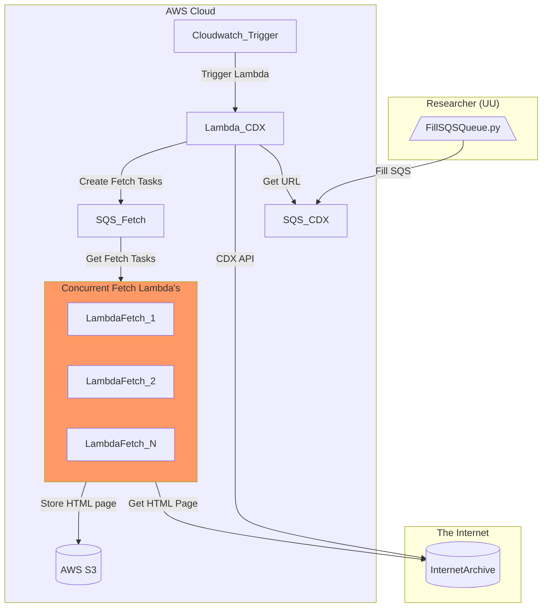

# ia-webscraping

## Architecture
The ia-webscraping repository utilizes the following AWS services:
- SQS: to create a queue of scraping tasks, manage the distribution of these tasks among the fetching Lambda functions and give insight in the result of the task.
- AWS Lambda: to run the fetching code without the need for provisioning or managing servers.
- S3: for storage of the HTML pages
- CloudWatch: to monitor the metrics of the SQS queue and Lambda functions
- CloudWatch trigger: to trigger the Lambda function on a timely basis, the interval can be changed to throttle the process

Deploying this solution will result in the following scrape pipeline in the AWS Cloud.

